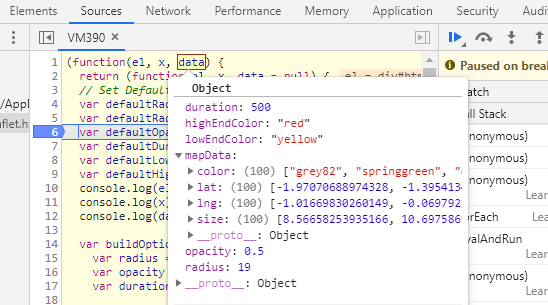

<!-- README.md is generated from README.Rmd. Please edit that file -->

# leaflethex

<!-- badges: start -->

<!-- badges: end -->

The goal of leaflethex is to create hexbin layers that can be added to
plots made with the leaflet package.

This is a work in progress and is not yet a functional R package. Stay
tuned\!

## Installation

You can install the released version of leaflethex from
[CRAN](https://CRAN.R-project.org) with:

``` r
install.packages("leaflethex")
```

And the development version from [GitHub](https://github.com/) with:

``` r
# install.packages("devtools")
devtools::install_github("rpruim/leaflethex")
```

## Example

This is a basic example which shows you how to solve a common problem:

``` r
library(leaflethex)
df = tibble(
  lat = rnorm(100),
  lng = rnorm(100),
  size = runif(100, 5, 20),
  color = sample(colors(), 100)
)
map <- leaflet::leaflet(df) %>% 
  leaflet::addTiles() %>% 
  leaflethex::add_hexbin(
    radius = 19, 
    lowEndColor = "yellow", 
    highEndColor="red",
    stroke = FALSE)
map
```

## How to Use Pure JS Leaflet Plugin Functions in R

1.  Create a new R script `add_plugin_name.R`

2.  Add a single function that takes `map` as its first parameter and
    returns it as the return value
    
    ``` r
      add_hexbin <- function(map, data = NULL) {
        data <- if(is.null(data)) leaflet::getMapData(map)
        map
      }
    ```

3.  Add the leaflet-esri.R file to the R directory or copy its functions
    into the new R file

4.  Set aside the R Code and find the complete desired javascript code

5.  Copy the code into a .js file then wrap the code in a `function()`
    as below
    
    ``` js
      function(el, x, data = null) {
        // Your JS Code
      }
    ```

6.  Modify this file to use the data parameter as needed, this parameter
    will be used for data points but also mapping options like radius or
    color or anything else one needs to pass into the js function

7.  Back to the R Code, create a Plugin with the `createPlugin()`
    function.
    
    ``` r
    # Load JS plugin - Hexbin Example
    hexbinPlugin <- createPlugin(
                      "Hexbin", "1.0.0", # Name and Verison
                      src= system.file("js", "", package = "leaflethex"), #Parent folder of the     dependencies and stylesheets
                      script = "deps.js", # JS File containing the dependencies
                      stylesheet="hexbin.css") 
    ```

8.  Using the JS file created earlier, load the code into a single
    String
    
    ``` r
      hexbinJS <- readr::read_file(system.file("js", "hexbin.js", package = "leaflethex"))
    ```

9.  Apply the Plugin to the map parameter and render the Javascript in
    the recently created string with the `OnRender()` function
    
    ``` r
      # Pipe the the plugin into the given map
      map <- map %>%
      registerPlugin(hexbinPlugin) %>%
        # Add your custom JS logic here. The `this` keyword
        # refers to the Leaflet (JS) map object.
        onRender(hexbinJS, data=mapData)
    
      map  # show the map
    ```

10. To pass Data from R to JS, create an S3 Object with the desired data
    
    ``` r
       # Build MapData from given data or mapData if none provided
       mapData <- if(!is.null(data)) data else leaflet::getMapData(map)
       # Add parameters to be passed to the JS plugin
       mapData <- list(mapData = mapData,
           radius = radius,
           opacity = opacity, # Additional Parameters
           duration = duration,
           lowEndColor = lowEndColor,
           highEndColor = highEndColor
       )
       class(mapData) <- "options" # This is necessary to pass the object as a JSON object instead of a JSON Array, much easier to deal with on the JS side
    ```

11. Then as shown above, it should be passed to the data parameter of
    OnRender

12. The Object comes out the outside in the JS World as a JSON Object
    
    
