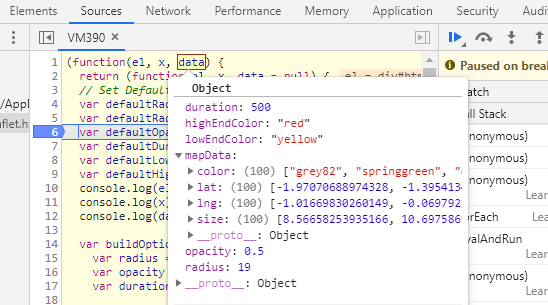

```{r, include = FALSE}
knitr::opts_chunk$set(
  collapse = TRUE,
  comment = "#>",
  fig.width = 6, fig.height = 3
)
```

```{r setup, include = FALSE}
library(leaflethex)
library(tibble)
library(dplyr)
```

## The Purpose for Leaflethex

Leaflethex is primarily a proof of concept for rendering leafletJS functionality in R by running the javascript though an htmlwidget.

It also contains a function `addHexbin()` for applying a hexbin layer to a leaflet map

## How to use leaflethex for the Hexbin Layer

If you are interested in using the hexbin plugin that comes along with
leaflethex, the function `addHexbin()` can be used which has a similar API to
the rest of the Leaflet R functions that add layers to leaflet maps such as
`leaflet::addCircles()`, `leaflet::addMarkers()`, etc.

The default use bins geopoints into hexagonal regions and used 
size and/or color to represent the number of points in each bin.

```{r}
# Randomly generated data points
data_points <- tibble(
  lat =  42.9634 + rnorm(1000),
  lng = -85.6681 + rnorm(1000)
)
# Create map with data points
leaflet::leaflet(data_points) %>% addTiles() %>% addHexbin()
```

## Features of addHexbin()


Radius, color, and opacity of hexagon are easily modified
using arguments to `addHexbin()`. As with other leaflet functions,
data is inherited from the map unless specified with the `data` argument.

For a more complete description of `addHexbin()`, see the function
help and package vignettes.


```{r}
data_points <- tibble(
  lat =  42.9634 + rnorm(1000),
  lng = -85.6681 + rnorm(1000)
)
data_points2 <- tibble(
  lat =  42.9634 + rnorm(1000),
  lng = -95.6681 + rnorm(1000)
)
leaflet::leaflet(rbind(data_points, data_points2)) %>% 
         addTiles() %>% 
         addHexbin(data = data_points) %>% 
         addHexbin(data = data_points2, 
                    lowEndColor  = "yellow", 
                    highEndColor = "red")
```

## Using leaflethex for arbitrary LeafletJS functionality: Overview

Leaflethex also provides a mechanism for creating hooks to arbitrary
javascript code via `pluginFactory()`. To modify existing javascript 
code that modfies a leaflet map so that it can be used from within R
using the leaflet R package 

#. Make a copy the JS code that modifies a map object. 

    Place this code in a new file and place the file in a new folder. (In the example below, this file will be called `example.js`.)
#. Edit the JS code to replace any reference of `map` with the keyword `this` so that the loaded plugin can attach to the given map instead of creating a new map. 

    Note: if the JS Code makes extensive use of DOM manipulation more work may be needed to make it compatible.
#. Download the libraries that the code depends on such as jquery, leaflet, d3, etc. as .js files.
#. Combine these .js files into a single .js file. 

    (In the example below, this file will be called `deps.js`.)
#. Create the plugin with `pluginFactory()`.

    ```{r eval=FALSE}
      new_plugin <- 
        pluginFactory(
          "Name of Plugin", 
          "path/of/parent/folder/", 
          "leaflet-script.js", 
          "deps.js", 
          "stylesheet.css")
      # Create a basic leaflet map
      leaflet::leaflet() %>% addTiles() %>% new_plugin()
    ```

## A More In-Depth Look at how JS Code is loaded into R

#. In R

    a. Create a new R script `add_plugin_name.R`
    a. In this file, create a single function that takes `map` as its first argument and returns it as the return value.

        ```{r eval = FALSE}
        # in add_plugin_name.R  
        addHexbin <- function(map, data = NULL) {
          data <- if(is.null(data)) leaflet::getMapData(map)
          map
        }
        ```

    c. Add the leaflet-esri.R file to the R directory or copy its functions into the new R file
    
#. In javascript

    a. Copy the javascript code into a .js file then wrap the code in a `function()` as below

        ```{js, eval = FALSE}
        function(el, x, data = null) {
          // Your JS Code
        }
        ```
    
    b. Now modify this file to use the data argument as needed, this argument will be used for data points but also mapping options like radius or color or anything else one needs to pass into the js function.


#. Back in R.

    a. create a plugin with the `createPlugin()` function.

        ```{r eval=FALSE}
        # Load JS plugin - Hexbin Example
        hexbinPlugin <- 
          createPlugin(
            "Hexbin", "1.0.0", # Name and Version
            # Parent folder of the dependencies and stylesheets
            src = system.file("js", "", package = "leaflethex"), 
            script = "deps.js", # JS File containing the dependencies
            stylesheet = "hexbin.css") 
        ```
    
    b. Load the JS code created earlier into a string.

        ``` {r eval = FALSE}
          hexbinJS <- 
            readr::read_file(system.file("js", "hexbin.js", package = "leaflethex"))
        ```

    c. Apply the plugin to the map argument and render the Javascript in the recently created string with the `onRender()` function

        ```{r eval=FALSE}
          # Pipe the the plugin into the given map
          map <- map %>%
          registerPlugin(hexbinPlugin) %>%
            # Add your custom JS logic here. The `this` keyword
            # refers to the Leaflet (JS) map object.
            onRender(hexbinJS, data = mapData)
          map  # show the map
        ```


#. To pass Data from R to JS, create an S3 "options" object with the desired data.

    ```{r eval=FALSE}
       # Build mapData from given data or mapData if none provided
       mapData <- 
         if(!is.null(data)) {
           data
         } else {
           leaflet::getMapData(map)
         }
       # Add arguments to be passed to the JS plugin
       mapData <- 
         list(
           mapData = mapData,
           radius = radius,
           opacity = opacity, 
           duration = duration,
           lowEndColor = lowEndColor,
           highEndColor = highEndColor
       )
       # This following is necessary to pass the object as a JSON object 
       # instead of a JSON Array. This is much easier to deal with on the JS side.
       class(mapData) <- "options" 
    ```

    a. As shown above, this object should be passed as the data argument of `onRender()`.

    b. The object appears in the JS World as a JSON Object

    


